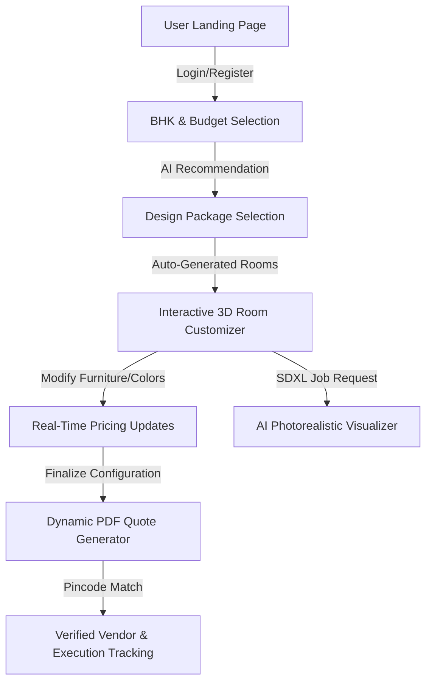

# 🏠 InteriorAI Platform

> **AI-Based Modular Interior Design & Visualization Platform**

InteriorAI is a comprehensive, premium web application designed to simplify the interior design journey for homeowners. By combining interactive 3D rendering, AI-powered photorealistic visualizations, real-time pricing updates, and verified contractor matching, the platform takes you from a blank BHK layout to a professional quotation and ready-to-execute design in under 10 minutes.

---

## 🚀 Key Features

*   **Interactive 3D Room Canvas**  
    Powered by **Three.js** and **React Three Fiber (R3F)**. Live 3D environment to customize walls, flooring, and adjust furniture arrangements (sofas, beds, wardrobes, kitchen counters, vanity units) in real time.
*   **AI Photorealistic Rendering**  
    Simulated **Stable Diffusion XL + ControlNet** rendering pipeline. Generate stunning, high-resolution photorealistic renders of your customized rooms under various interior styles (Modern, Scandinavian, Art-Deco, Luxury, Mediterranean, Tropical) in less than 15 seconds.
*   **Normalized Product Catalog & Variant Customization (New)**  
    Group catalog entries under single base models (e.g., Sofa A) instead of duplicate rows. Customize specific parameters (Color, Fabric, Wood Finish, Size, Texture, Cushion Style) dynamically from the configuration panel, with configurations stored in SQLAlchemy database JSON schemas.
*   **Mandatory Room Layout Completeness (New)**  
    Validates room progress checklists against mandatory categories (e.g., Living Room requires at least a Sofa, Coffee Table, and Rug) before enabling AI visualization. Displays visual alerts and missing requirements checklists.
*   **Iterative Swap & Background Re-render (New)**  
    Allow users to swap room products or modify customization parameters directly from the AI rendering canvas sidebar, auto-triggering background perspective re-rendering without losing other room selections.
*   **Smart AI Recommendation Engine**  
    Scores and ranks catalog items and furniture packages using dynamic style compatibility matrices and budget-fitting algorithms to present the most cost-effective and aesthetic choices for your home.
*   **Real-Time Pricing & Dynamic Budgeting**  
    Every furniture addition, finish change, or room size modification instantly updates your total cost. Maintain granular control over your budget with zero price surprises.
*   **ReportLab PDF Quotation Generator**  
    Dynamically generates professional, bank-compliant PDF quotes with detailed room-by-room line items, GST breakdown, terms and conditions, and customized styling.
*   **Role-Based Login & Routing Flow**  
    True role-based authentication separating Customer, Vendor, Project Team, and Admin portals. Accessing a role dynamically updates the navigation bar options, restricting views and links contextually (Home, Portal Link, and Support).
*   **Reviewer Auto-Fill Test Profiles**  
    Select your desired role tab (Customer, Vendor, Project Team, or Admin) on the login screen to automatically fill pre-registered reviewer test credentials, enabling instant login and walkthroughs.
*   **Integrated Milestone Payments Portal**  
    Granular timeline checklist (Booking Advance 10%, Production 40%, Installation 40%, Handover 10%) supporting mockup checkouts, invoice downloads, and receipt tracking.
*   **Special Services Project Spawning**  
    Simulates immediate card/UPI payment checkout for services (e.g. 3D rendering) to automatically spawn matching projects, quotations, and active milestones tracking logs.
*   **Sourcing Progression & Vendor Payouts**  
    Coordinators log item-by-item status updates (ordered to installed) that automatically recalculate overall project progress. Marking items as "Installed" triggers automated vendor payout logs.
*   **Adaptive Landing Page CTA & Header:**  
    Landing page CTA buttons ("Start Designing Free") dynamically detect login sessions to route authenticated users directly to their active portals instead of displaying redundant login forms.
*   **Grouped Vendor Assignments & Onboarding (New):**  
    Onboarding wizard category specialization checkboxes (Furniture, Kitchen, Lighting, Décor). Re-architected project-wise grouped assignments cards featuring inline milestone status update selects, immediate verification photo proof uploads, live shipment logistics tracking (Courier, Vehicle details, Tracking AWB), and interactive 5-stage milestone payouts checklist.
*   **Project Workspace Details Sidebars & Access Control (New):**  
    Enforces project-wise member access validation (Coordinator/Technician roles check against project assignments). Automatically calculates project-level status ("On Track", "Delayed", "Completed"). Added Customer Profile and Vendor directory sidebar grids directly into the team execution panel workspace.
*   **4-Wall AI Rendering & Custom view modes (New):**  
    Replaced the 3D canvas viewport on the visualization page with a 2x2 grid showing Wall A, B, C, D perspectives. Supports Blueprint Templates, custom wall Photo Uploads, and room Dimension inputs with automatic pillar clearance calculation.
*   **Real-Time Selection State Monitoring & Debounced Sync (New):**  
    Tracks onboarding and customize stage selections in the frontend Zustand store, syncing them via a debounced backend API to the database. Enables O(1) latency prompt compilation for Gemini on generation submit.
*   **Instant Quotation Sourcing Sync (New):**  
    Automatically synchronizes quotation items to verified vendor dashboards immediately upon quotation generation, removing vendor rejection permissions to ensure solid sourcing fulfillment.
*   **AI Architecture Proposal Document (New):**  
    Added a comprehensive architectural report (`ai_architecture_proposal.docx`) to the project root, detailing the agentic spatial layout and color harmonization rules.
*   **Automatic Tab Progression & Customizer Wizard (New):**  
    When a customer saves the selection for the last category of a room, the customizer wizard automatically switches to the next room tab and pre-selects its first category.
*   **Multi-View Product Image Upload Pipeline (New):**  
    Allows vendors to upload up to 3 high-resolution images (Main/Front View, Side View, Perspective View) concurrently. The backend API maps them to specific view slots and sets the index-0 image as the product's primary thumbnail.
*   **Thumbnail-based Gallery Carousels (New):**  
    Integrates an Amazon/Flipkart-style image gallery slider inside both the Customer Customize drawer and the Customer Visualize swap drawer. Displays "Front", "Side", and "Top" indicators with next/prev arrows, failing back to a clean placeholder card if optional views are not uploaded.
*   **Auto-Regenerating Quotations (New):**  
    If a customer returns to the quotation page after editing their configurations when their previous quote was `'rejected'` or `'under_revision'`, the page automatically triggers a new PDF and quote calculations to present updated figures immediately.
*   **Custom Glassmorphic Project Deletion (New):**  
    Replaces browser native alerts with a premium glassmorphic confirmation modal featuring slide-up animations, backdrop blurs (`bg-white/80 backdrop-blur-xl`), and detailed info checks.
*   **Customer Tracking & Sourcing Redesign (New):**  
    Replaces customer-side dropdown lists with a dual horizontal tracker system. A read-only **Vendor Status Bar** visualizes item sourcing progress (Ordered to Dispatched) in real-time. An interactive **Customer Verification Bar** permits the customer to directly confirm deliveries and installations.
*   **Solid Container Backgrounds & Contrast Controls (New):**  
    Ensures optimal text contrast on light/purple mesh gradients by wrapping primary dashboard tracking sections in a solid dark navy-indigo shade (`bg-[#0f1129]`).
*   **Purple-Indigo Gradient File Uploader (New):**  
    Features a high-visibility file upload action button styled with custom purple-to-indigo gradient layouts inside verification forms.
*   **Seeded Assets Track Status:**  
    The custom-generated component images in `backend/pdfs/catalog/` are tracked directly inside Git (deliberately omitted from `.gitignore`) to ensure a fresh repository clone receives the visual catalog out-of-the-box.

---

## 🛠️ Tech Stack

### Frontend (Next-Gen Web Interface)
*   **Framework:** Next.js 14 (App Router) & React 18
*   **Language:** TypeScript
*   **Styling:** TailwindCSS & Framer Motion (for smooth micro-animations)
*   **3D Graphics:** Three.js, `@react-three/fiber`, `@react-three/drei`
*   **State Management:** Zustand
*   **Data Fetching:** SWR (Stale-While-Revalidate) & Axios

### Backend (Robust RESTful API)
*   **Framework:** FastAPI (Python 3.10+)
*   **Server:** Uvicorn (ASGI)
*   **Database ORM:** SQLAlchemy (SQLite database by default: `interior_ai.db`)
*   **Data Validation:** Pydantic v2
*   **Authentication:** JWT (JSON Web Tokens) via `python-jose` & `passlib` (Bcrypt)
*   **PDF Generation:** ReportLab PDF library
*   **Image Processing:** Pillow

---

## 📁 Project Directory Structure

```text
Interior_Design/
├── 1_Click_Run.bat         # Windows automated launcher (Backend + Frontend + DB Seeding)
├── .gitignore              # Configured file exclusions (venv, node_modules, build outputs)
├── backend/
│   ├── .env                # Server configuration & JWT secrets
│   ├── requirements.txt    # Python package dependencies
│   ├── pdfs/               # Generated quotation PDFs & uploaded floor plans
│   └── app/
│       ├── __init__.py
│       ├── main.py         # Application entry point & router mounting
│       ├── db.py           # Database engine & session setup
│       ├── models.py       # SQLAlchemy database schemas (User, Project, Room, Product, etc.)
│       ├── schemas.py      # Pydantic schemas for request/response serialization
│       ├── auth_utils.py   # JWT token issuing and authentication dependencies
│       ├── seed_data.py    # Mock products, design packages, and vendors seeding
│       ├── routers/        # Modular API endpoints (Auth, Projects, Catalog, AI, PDF, etc.)
│       └── services/       # Core service modules (PDF creation, AI render mocks)
└── frontend/
    ├── package.json        # Frontend NPM script definitions & dependencies
    ├── next.config.js      # Next.js configurations
    ├── tsconfig.json       # TypeScript rules
    └── src/
        ├── app/            # Next.js App Router pages (Dashboard, Customizer, Visualizer, etc.)
        ├── components/     # Reusable UI widgets & Three.js Canvas (`RoomCanvas3D`)
        └── stores/         # State management stores (Auth, Project state synchronization)
```

---

## ⚡ Quick Start (Windows)

The repository comes with a batch script that automates environment check, dependency installation, database initialization, seeding, and server startup.

1. Double-click the **`1_Click_Run.bat`** file at the root folder of the project.
2. The script will:
   * Validate that **Python 3.10+** and **Node.js 18+** are installed.
   * Initialize a Python virtual environment (`.venv`) in `backend/` and install `requirements.txt`.
   * Install frontend dependencies via `npm install` in `frontend/`.
   * Initialize the SQLite database and seed it with high-quality default design packages, furniture catalogs, and vendor contacts.
   * Run the FastAPI server (`http://localhost:8000`) and the Next.js development server (`http://localhost:3000`).
   * Automatically open the platform in your browser at `http://localhost:3000`.

---

## 🔧 Manual Setup (All OS)

If you prefer to run the components manually, open two terminal windows:

### 1. Backend Setup
```bash
cd backend
# Create and activate python virtual environment
python -m venv .venv
source .venv/bin/activate       # On Windows: .venv\Scripts\activate

# Install dependencies
pip install -r requirements.txt

# Start FastAPI server
python -m uvicorn app.main:app --host 0.0.0.0 --port 8000 --reload
```
*   **API Documentation**: Access Swagger UI at `http://localhost:8000/docs`.

### 2. Frontend Setup
```bash
cd frontend
# Install node packages
npm install

# Start Next.js development server
npm run dev
```
*   **Client App**: Access the interface at `http://localhost:3000`.

---

## 🔄 Core Application Flow



---

## 🛡️ Security & Environment Settings

The configuration is managed via a `.env` file in the root directory. The batch launcher (`1_Click_Run.bat`) automatically synchronizes this file into the `backend/` directory during startup.

In production environments, make sure to change the default values:

```env
DATABASE_URL=sqlite:///./interior_ai.db
JWT_SECRET=your_secure_production_jwt_secret_key_here
JWT_ALGORITHM=HS256
ACCESS_TOKEN_EXPIRE_MINUTES=60
PDF_OUTPUT_DIR=./pdfs

# Google AI Studio API Key for AI Photorealistic Room Rendering (Imagen 3)
GEMINI_KEY=your_gemini_api_key_here
```

---

## 📝 License
Built with ❤️ for Indian homeowners. Distributed under the MIT License. See `LICENSE` for more information.
